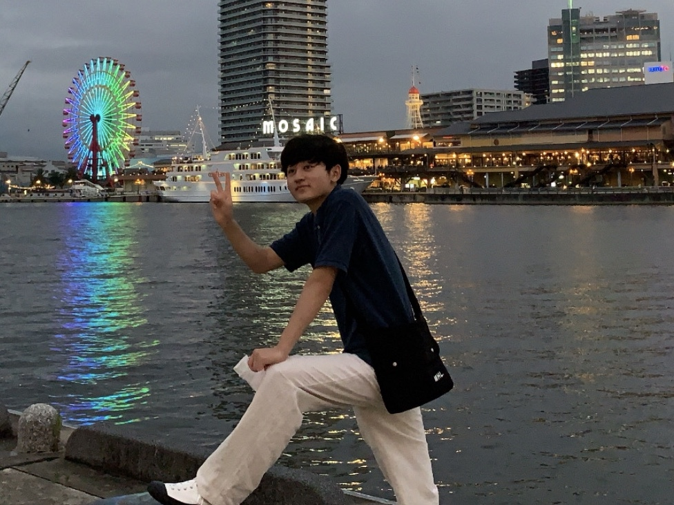

 

# About Me
20年間京都に住んでます！！  
大学卒業後は京都を出るぞ！！
2020年3月よりプログラミング学習開始！！  
2020年3月　〜　2020年6月 プログラミング教室GeekSalonにて基礎を学びオリジナルのwebアプリケーションを作成！！  
2020年7月　〜 独学でJavaScript,Node.js,AWSなどを勉強し始める！！  

将来は、エンジニアもしくはプログラミングの知識・スキルを活かせる職に就きたい！！  

## Profile
中川　友太朗 
大学：同志社大学経済学部経済学科３回生 
居住地：京都市 
誕生日：1999/11/30 
好きなYouTuber:中田敦彦のYouTube大学 
<iframe width="560" height="315" src="https://www.youtube.com/embed/FH7L0kyl2GA" frameborder="0" allow="accelerometer; autoplay; encrypted-media; gyroscope; picture-in-picture" allowfullscreen></iframe>

# Skills
使ったことや興味のある言語、ツール、OS
- OS（Linux,Ubuntu）
- Languages　(HTML&CSS,Sass,Ruby,Ruby on rails,JavaScript,Node.js, Expressなど)
- Tool,MiddleWare（Git,GitHub,AWSなど）
- 資格、免許（普通自動車運転免許（笑））

# Works
- [GitHub](https://github.com/tomosuke-art)
- 作った作品
  - [Let`s Share My Favorite!](lets-share-netflix.herokuapp.com/) -> Netflixのオススメ作品を共有するサイト

# Contact
- [Twitter](https://twitter.com/tomotomo_1D) 
<a class="twitter-timeline" data-width="400" data-height="400" data-theme="light" href="https://twitter.com/tomotomo_1D?ref_src=twsrc%5Etfw">Tweets by tomotomo_1D</a> 
- [Facebook](https://www.facebook.com/profile.php?id=100011250104610)
- [Mail](taro91834@gmail.com)

# History
学歴、職歴、アルバイト、インターン経験など。
- 2018年 　　同志社大学経済学部入学
- 2018年 〜　飲食・小売・清掃のアルバイト,バスケットボールのサークル活動
- 2020年 〜　IT業界を中心に幅広くみてます！
